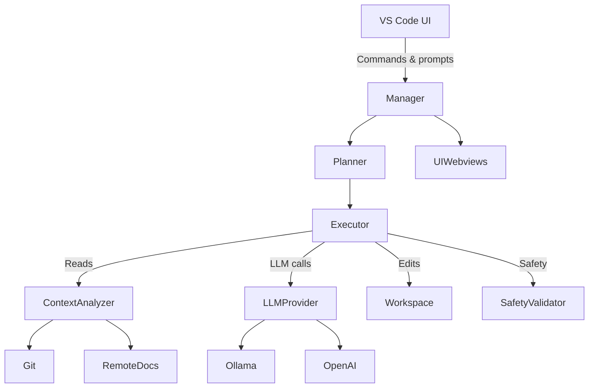

# code-companion 🚀

An autonomous AI pair programmer for VS Code

---

## ✨ Features
• Chat with an **AI coding assistant** directly in the sidebar or panel.
• **Generate, edit & refactor** files – workspace edits applied automatically.
• **Multi-step task planner** (analysis → design → code → tests → docs).
• Inline diff & safety guardrails (blocks destructive commands, sensitive files).
• Works with multiple LLM back-ends: **Ollama**, **OpenAI**, or your own via plugin.
• Fetches **remote package READMEs** to give the model extra context.
• GitHub integration for PR diff summaries and automated review comments.
• Rich task & status webviews – cancel / retry individual steps.

## 📦 Installation
1. Ensure you have **Node.js ≥ 18** and **VS Code ≥ 1.85**.
2. Install from the VSIX in the repo root:
   ```bash
   code --install-extension code-companion-0.1.0.vsix
   ```
3. Reload VS Code and look for the `code-companion` icon in the Activity Bar.

## 🚀 Quick Start
1. Open any workspace.
2. Launch the **Chat** view (icon in Activity Bar).
3. Type a natural-language request, e.g. `Add dark-mode toggle`.
4. Review the generated **execution plan**, edit if necessary, then run.
5. Code Companion applies changes – look for inline decorations or accept the edits.

## ⚙️ Configuration
Set these in your user or workspace `settings.json`:
| Setting | Default | Description |
|---------|---------|-------------|
| `codeCompanion.llmProvider` | `ollama` | Selects the active LLM provider (`ollama` or `openai`). |
| `codeCompanion.confirmChanges` | `true` | Ask before applying edits. Markdown files are applied directly without diff. |
| `codeCompanion.enableAutoSave` | `true` | Automatically save documents after edits. |
| `codeCompanion.openAi.apiKey` | `""` | API key when `llmProvider` is `openai`. |

## 🏗 Architecture Overview


## 📂 Project Structure (depth 2)
```
📄 .eslintrc.json
📄 DEVELOPMENT_SETUP.md
📄 IMPLEMENTATION_PLAN.md
📄 LICENSE
📄 README.md
📄 README.md.codecompanion
📄 README.md.codecompanion-1752349197779
📄 README.md.codecompanion-1752349886654
📄 TECHNICAL_ARCHITECTURE.md
📄 code-companion-0.1.0.vsix
📄 package-lock.json
📄 package.json
📁 resources
  📄 icon.svg
📁 src
  📁 agent
    📄 context.ts
    📄 executor.ts
    📄 planner.ts
    📄 remotedocs.ts
    📄 safety.ts
  📄 extension.ts
  📁 git
    📄 github.ts
  📁 llm
    📄 ollama.ts
    📄 openai.ts
    📄 provider.ts
  📄 manager.ts
  📄 types.ts
  📁 ui
    📄 chat.ts
    📄 status.ts
    📄 tasks.ts
📄 tsconfig.json
```

## 🧑‍💻 Development
```bash
# install deps
npm install
# launch the extension host
code . --extensionDevelopmentPath=.
```

### Scripts
- **vscode:prepublish**: `npm run compile`
- **compile**: `tsc -p ./`
- **watch**: `tsc -watch -p ./`
- **pretest**: `npm run compile && npm run lint`
- **lint**: `eslint src --ext ts`
- **test**: `node ./out/test/runTest.js`

### Runtime Dependencies
- axios
- ws
- node-fetch
- diff
- glob
- chalk
- @octokit/rest

### Dev Dependencies
- @types/vscode
- @types/node
- @typescript-eslint/eslint-plugin
- @typescript-eslint/parser
- eslint
- typescript
- @types/diff

## 📅 Roadmap
- [ ] Better inline diff/merge UX.
- [ ] Context caching & chunking for large workspaces.
- [ ] Additional LLM providers (Anthropic, Gemini).
- [ ] Auto-generated unit & integration tests.

## 🤝 Contributing
PRs and issues are welcome! Please read **DEVELOPMENT_SETUP.md** first.

## 📝 License
MIT © 2025 code-companion Authors


---
_Updated by CodeCompanion on 2025-07-12T20:01:58.678Z_